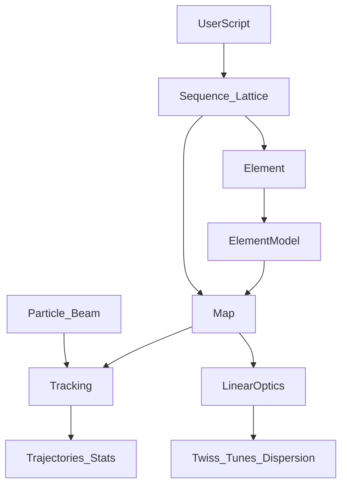

# BELL Architecture (draft)

This document captures the current target architecture for turning BELL from a linear-MVP into a **maps-first** accelerator dynamics library, where:

- a **transfer Map** is the primary object,
- a **6×6 matrix** is just the **linear part** (order 1) of a Map,
- higher-order behaviour is implemented via **Lie maps / generators** (per `docs/ref/` sources).

## Big picture

## Layers (simple definitions)

- **Sequence/Lattice**: ordering/repetition of elements and convenience utilities (length, s-positions, flattening).
- **Element**: *what it is* (drift/quad/bend/...) + parameters.
- **ElementModel**: *the math* for an element (in our scope: Lie formalism); implementations must be traceable to `docs/ref/`.
- **Map**: transfer object that supports composition and application to phase-space states.
- **Tracking**: apply Map(s) to `Particle` / `Beam` through a lattice (and over turns).
- **LinearOptics**: Twiss/tunes/dispersion computed from the **linear part** of Map.

## Current codebase status (today)

The current MVP is linear:

- Elements expose `map6()` (6×6 matrix): `src/bell/elements.py`
- Lattice multiplies matrices and tracks by `x <- M @ x`: `src/bell/lattice.py`
- Twiss helper works on 2×2: `src/bell/optics.py`

## Target package structure (where things should live)

- `src/bell/maps/` — maps + Lie formalism
  - `map.py`: `Map` interface (compose/apply/linear_part)
  - `linear.py`: `LinearMap` (6×6; optional affine shift if needed)
  - `lie/`: generators, brackets, exp-map, composition (details come from refs)
- `src/bell/elements.py` — element classes + parameters
- `src/bell/models/` — element physics models (parameter -> Map)
- `src/bell/lattice.py` — sequence/lattice, map aggregation, tracking
- `src/bell/optics.py` — linear optics from `LinearMap`
- `docs/ref/` — knowledge base / references (manuals, papers, links)

## Minimal Map contract

A Map implementation must provide:

- `compose(other) -> Map` meaning `self ∘ other` (apply `other` first, then `self`)
- `apply(x: R^6) -> R^6`
- `linear_part() -> LinearMap` for optics

## Lie formalism: what we *do not* assume upfront

We intentionally do **not** hardcode conventions without sources. After you add references to `docs/ref/`, we will lock down:

- coordinate conventions and normalizations (\(x, p_x, y, p_y, z, \delta\))
- sign conventions and Hamiltonian/Lie operator definitions
- per-element map derivations and allowed approximations

